  

  

  
  
  
  
  
  

---

## ✦ Subject Profile // About Me

Hello! I'm **Sanidhya Joshi**, a B.Tech Computer Science and Engineering student at the **Indian Institute of Information Technology, Sri City (IIITS)** (GPA: **9.24/10**). 

I am a software engineer specializing in **Full Stack Development**, **Backend Systems**, and **AI/ML Solutions**. My work focus centers on building highly interactive, real-time web applications, designing scalable backend systems, and engineering semantic document intelligence platforms (RAG pipelines).

### 📡 Core Operatives:
- 💼 **Lead Full Stack Developer** for the **Full Stack Development Team** at IIIT Sri City, directing the architecture of real-time collaborative systems.
- 🔬 **Research Student** in **Air Pollution & Financial Data Science**, analyzing relationships between environmental metrics and economic indicators using predictive models, statistical analysis, and the U.S. EPA's BenMAP software.
- 🏆 **Competitive Programmer** active on **LeetCode, Codeforces, and CodeChef**.
- 🎨 **UI/UX & Creative Designer** focusing on clean, Monochromatic HUD interfaces and system dashboard aesthetics.

---

## ✦ Active Dossiers // Major Projects

| Project / Codebase | Technical Narrative & Observations | Core Stack | Status |
| :--- | :--- | :--- | :--- |
| **[Axion](https://github.com/joshisanidhya/collaborative-code-editor)**   [Live Demo](https://collaborative-code-editor-gamma-one.vercel.app/) | **Real-Time Collaborative Code Editor** • Low-latency code synchronization via Socket.IO client-server event streams. • Secure room management and active presence/typing indicators. • Multi-user live editing and shared code execution via Judge0 CE REST API. | React 18, Node.js, Express, Socket.IO, PostgreSQL, Prisma ORM, Monaco Editor, Docker | `Active` |
| **[SAGE](https://github.com/joshisanidhya/ai-pdf-chatbot)**   [Vector AI] | **Semantic AI Generation Engine (RAG Chatbot)** • AI document assistant extracting context from uploaded PDFs. • Context-aware conversations grounded via similarity vector search. • Token-optimized chunking and local embeddings (`all-MiniLM-L6-v2`). | Python, FastAPI, LangChain, MongoDB, `@xenova/transformers`, Sentence-Transformers, OpenRouter | `Active` |
| **[Automata Studio](https://github.com/joshisanidhya/toc)**   [Live Demo](https://automata-studio-toc.vercel.app/) | **Theory of Computation Simulator** • Interactive simulator for DFA, NFA, PDA, and Turing Machines. • Visualizes computational transitions and state execution paths. • Custom-built SVG rendering engine and smooth state-transition animations. | React.js, JavaScript, Custom SVG Transitions | `Completed` |

---

## ✦ Technical Arsenal // Skills

| Category | Badges |
| :--- | :--- |
| **Languages** |       |
| **Web Development** |        |
| **Data & Core** |    |
| **AI/ML & Research** |    |
| **Cloud & DevOps** |      |
| **UI/UX & Creative** |    |

---

<!-- ========================= -->
<!-- Competitive Programming & Analytics (Temporarily Disabled) -->
<!-- ========================= -->
<!--
## ✦ Competitive Programming & Analytics

  
  

 

  
  

  
  

---
-->
<!-- End Competitive Programming & Analytics -->

<!-- ========================= -->
<!-- Contribution Grid Activity (Temporarily Disabled) -->
<!-- ========================= -->
<!--
## ✦ Contribution Grid Activity

  <picture>
    <source media="(prefers-color-scheme: dark)" srcset="https://raw.githubusercontent.com/joshisanidhya/joshisanidhya/output/github-contribution-grid-snake-dark.svg" />
    <source media="(prefers-color-scheme: light)" srcset="https://raw.githubusercontent.com/joshisanidhya/joshisanidhya/output/github-contribution-grid-snake.svg" />
    
  </picture>

---
-->
<!-- End Contribution Grid Activity -->

## ✦ Honors & Awards
- 🥇 **LeetCode Competitive Programming** | LeetCode, CodeForces, CodeChef
- 🏷️ **IAENG Member** | Member of the International Association of Engineers | *March 2026*
- 👥 **Lead Full Stack Developer** | Lead of Technical Development Team | *Jan 2026*

---

  <code>CASE_FILE: SJ-0824</code> · <code>STATUS: ACTIVE</code> · <code>RECRUITER_CLEARANCE: APPROVED</code> 
  Designed with precision &amp; purpose. © 2026 Sanidhya Joshi

